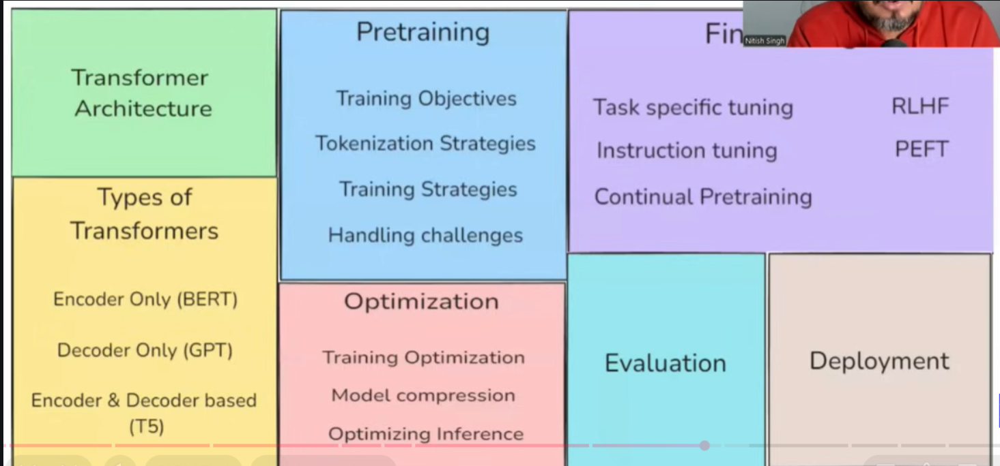
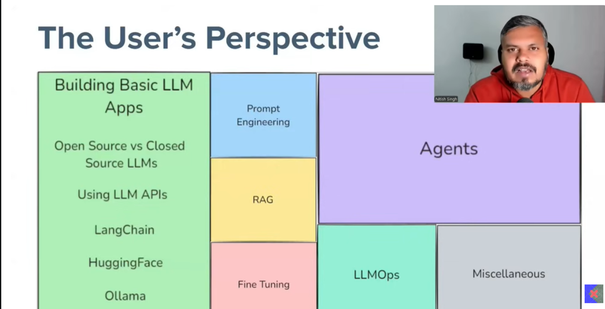

# 🤖 Generative AI — Introduction Canvas

---

## What is Generative AI?

> **Generative AI** is a type of artificial intelligence that creates new content — such as text, images, music, or code — by learning patterns from existing data, mimicking human creativity.

### The AI Hierarchy

```
┌─────────────────────────────────────┐
│               AI                    │
│   ┌─────────────────────────────┐   │
│   │            ML               │   │
│   │   ┌─────────────────────┐   │   │
│   │   │         DL          │   │   │
│   │   │   ┌─────────────┐   │   │   │
│   │   │   │   Gen AI    │   │   │   │
│   │   │   └─────────────┘   │   │   │
│   │   └─────────────────────┘   │   │
│   └─────────────────────────────┘   │
└─────────────────────────────────────┘
  AI → ML → Deep Learning → Gen AI
```

---

## Why is GenAI Successful?

| Validation Question | Answer |
|---|---|
| Does it solve real-world problems? | ✅ Yes — customer support, content creation, education, software development |
| Is it useful on a daily basis? | ✅ Yes |
| Has it impacted global economies? | ✅ Yes |
| Does it create new jobs? | ✅ Yes — prompt engineers, AI engineers |
| Is it easily accessible? | ✅ Yes |

---

## Real-World Use Cases

- **Customer Support** — 24×7 AI-powered assistance
- **Content Creation** — articles, images, videos, music
- **Education** — ask questions, get explanations (ChatGPT, Claude)
- **Software Development** — code generation, debugging, review

---

## Mental Model — Two Perspectives

```
                    Foundation Model (LLM)
                           │
          ┌────────────────┴────────────────┐
          │                                 │
   Builder Perspective               User Perspective
   (Creating LLMs)                  (Using LLMs)
```

### Which side does each concept belong to?

| Concept | Perspective | Why |
|---|---|---|
| Prompt Engineering | 👤 User | Directly interacts with LLM |
| RLHF | 🔧 Builder | Used to train LLMs |
| RAG | 👤 User | Q&A on own documents using LLM |
| Quantization | 🔧 Builder | Optimizes model for different environments |
| AI Agents | 👤 User | LLM takes actions on behalf of users |
| Vector Database | 👤 User | Supports retrieval in apps |
| Fine-tuning | 🔄 Both | Can be done by builders and users alike |

---

## Builder's Perspective — How LLMs Are Built



### Transformer Architecture

| Type | Example |
|---|---|
| Encoder Only | BERT |
| Decoder Only | GPT |
| Encoder & Decoder | T5 |

### Pretraining

- Training Objectives
- Tokenization Strategies
- Training Strategies
- Handling Challenges

### Fine-tuning

- Task-specific Tuning
- Instruction Tuning
- Continual Pretraining
- **RLHF** — Reinforcement Learning from Human Feedback
- **PEFT** — Parameter-Efficient Fine-Tuning

### Optimization

- Training Optimization
- Model Compression
- Optimizing Inference
- **Quantization** — run models in different environments efficiently

### Evaluation

- Leaderboards — which LLM performs better in which area
- Benchmarks
- Model Comparison

### Deployment

- Inference Serving
- Scaling
- Monitoring

---

## User's Perspective — Using LLMs



### Building Basic LLM Apps

- Open Source vs Closed Source LLMs
- Using LLM APIs
- **LangChain** — framework for chaining LLM calls
- **HuggingFace** — open-source model hub
- **Ollama** — run LLMs locally

### Prompt Engineering

- Zero-shot prompting
- Few-shot prompting
- Chain-of-thought prompting
- System prompts & instruction design

### RAG (Retrieval-Augmented Generation)

> Ask questions against your own documents using a vector database + LLM

### AI Agents

> LLM takes actions autonomously — tool use, planning, multi-agent systems

### LLMOps

- Monitoring model performance in production
- Versioning & reproducibility
- Cost management

### Fine-tuning *(also builder side)*

- Adapt a pre-trained LLM to a specific task
- Both builders (during LLM creation) and users (customizing an existing LLM) can fine-tune

### Miscellaneous

- Vector Databases (Pinecone, Weaviate, Chroma)
- Evaluation & testing frameworks

---

## Do We Need to Learn Both?

```
  ┌─────────────────────────┐        ┌─────────────────────────┐
  │    Builder Side         │        │      User Side          │
  │    Data Scientist       │        │   Software Developers   │
  │                         │        │                         │
  │  • Transformer arch     │        │  • LLM APIs             │
  │  • Pretraining          │   ╔══╗  │  • Prompt Engineering   │
  │  • Optimization         │   ║AI║  │  • RAG                  │
  │  • RLHF                 │   ║Eng║ │  • Agents               │
  │  • Quantization         │   ╚══╝  │  • LLMOps               │
  │                         │        │                         │
  └─────────────────────────┘        └─────────────────────────┘
                    ↑
           AI Engineer sits at
           the intersection of both
```

### The AI Engineer

An **AI Engineer** sits at the intersection of both worlds:
- Knows *enough* about how LLMs are built (builder side)
- Can build products and applications *on top* of LLMs (user side)
- Bridges the gap between research and real-world deployment

---

## Quick Reference Glossary

| Term | Definition |
|---|---|
| **LLM** | Large Language Model — foundation model trained on massive text data |
| **Transformer** | Neural network architecture powering most modern LLMs |
| **RLHF** | Reinforcement Learning from Human Feedback — aligns LLMs with human preferences |
| **PEFT** | Parameter-Efficient Fine-Tuning — fine-tunes only a small subset of model weights |
| **RAG** | Retrieval-Augmented Generation — combines search with LLM generation |
| **Fine-tuning** | Further training a pre-trained model on task-specific data |
| **Quantization** | Reducing model precision to run efficiently on different hardware |
| **Vector DB** | Database that stores embeddings for semantic similarity search |
| **AI Agent** | LLM-powered system that takes autonomous actions via tools |
| **LLMOps** | Operational practices for deploying and monitoring LLM applications |

---

*Notes by Nitish Singh · GenAI Course Introduction*
