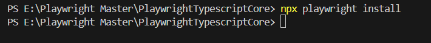
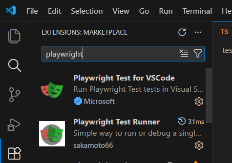

# What covered in notes

- Playwright setup
- npm and npx
- Purpose of Package.json, Package-lock.json,Playwright.config.ts,tsconfig.json

## Initialize Node Project


## Step 1. Initialize Playwright

Run the Playwright setup command:

```bash
npm init playwright@latest
```

During setup:

- Select **TypeScript**
- Choose **tests folder** (default recommended)
- Select browsers as required


---

## Step 3️⃣ Verify Playwright Version

```bash
npx playwright --version
```


Confirms Playwright is installed correctly.

---

## Step 4️⃣ Install Required Dev Dependencies

```bash
npm install --save-dev @playwright/test typescript ts-node
```


These are required for:

- Playwright test runner
- TypeScript support
- Running TS files

---

## Step 5️⃣ Install Playwright Browsers (Optional if already insteadll while run command npm init playwright@latest)

```bash
npx playwright install
```

This downloads:

- Chromium
- Firefox
- WebKit


---

## Step 6️⃣ Create `tsconfig.json`

For create tsconfig.json we have command npx tsc --init but in that need some changes So 

Create a file named **`tsconfig.json`** in the root folder and **copy–paste** below configuration:

```json
{
  "compilerOptions": {
    "target": "ESNext",
    "module": "NodeNext",
    "moduleResolution": "NodeNext",
    "strict": true,
    "noEmit": true,
    "isolatedModules": true,
    "esModuleInterop": true,
    "allowSyntheticDefaultImports": true,
    "resolveJsonModule": true,
    "skipLibCheck": true,
    "forceConsistentCasingInFileNames": true,
    "types": ["node", "@playwright/test"]
  },
  "include": ["**/*.ts"]
}


```
### ----------------------Setup Done Here for Run first Playwright Test --------------------------------
---

### Extensions good to use before start Playwright Program

### 1. Playwright Test for VScode
### 2. Playwright Test Runner


##  npm vs npx (Important for Interviews)

### 1️⃣ npm (Node Package Manager)

**Purpose:**

- Used to install, update, and remove packages

**Main work:**

- Installs packages and saves them inside `node_modules`

**Common commands:**

```bash
npm install playwright
npm install -D typescript
npm uninstall lodash
```

**When to use `npm`:**

- When you want a package **permanently** in your project
- When the package is used **again and again**

---

### 2️⃣ npx (Node Package Execute)

**Purpose:**

- Used to **run / execute a package directly** without installing it globally

**Common commands:**

```bash
npx playwright install
npx playwright test
npx tsc --init
```

**When to use `npx`:**

- One-time execution
- Running project-local binaries
- Avoid global installs

---

### 3️⃣ npm vs npx – Quick Comparison

| Point                 | npm                   | npx                  |
| --------------------- | --------------------- | -------------------- |
| Full form             | Node Package Manager  | Node Package Execute |
| Main job              | Install packages      | Run packages         |
| Global install needed | Sometimes             | No                   |
| Adds to package.json  | Yes                   | No                   |
| node_modules usage    | Yes                   | Temporary / Local    |
| Best use case         | Dependency management | One-time execution   |

---

### Interview One-Liner

> **npm is used to install packages, while npx is used to execute packages directly without global installation.**

---

## Summary ✅

- Playwright setup completed
- TypeScript configured
- Browsers installed
- npm vs npx clearly understood

## Purpose of installed files

## 1️⃣ `package.json`

### Purpose

- Acts as the **identity card of the project**
- Defines what the project is and which dependencies it needs

### What it contains

- Project name & version
- Scripts (e.g. `npm test`, `npx playwright test`)
- `dependencies` and `devDependencies`

### Interview one-liner

> `package.json` defines project metadata and dependency requirements.

---

## 2️⃣ `package-lock.json`

### Purpose

- Locks the **exact versions** of all installed dependencies
- Ensures **same dependency tree** on every machine

### Why it is important

- Avoids version mismatch issues
- Guarantees consistent builds in:
  - Team environments
  - CI/CD pipelines

### Practical Real-World Problem (Very Important)

#### ❌ Without `package-lock.json`

- Developer A installs dependencies today
- Developer B installs dependencies tomorrow
- Minor version updates get installed automatically
- Result:
  - Tests pass on one machine
  - Tests fail on another machine
  - CI pipeline fails randomly

Example:

- One system installs `playwright@1.42.0`
- Another installs `playwright@1.43.0`

---

#### ✅ With `package-lock.json`

- Exact versions are locked
- Same dependencies installed everywhere
- No random failures
- Stable automation runs

### How it solves the problem

- Forces npm to install **exact versions**
- Eliminates "works on my machine" issues

### Interview one-liner

> `package-lock.json` ensures reproducible builds by locking dependency versions.

---

## 3️⃣ `playwright.config.ts`

### Purpose

- Central configuration file for Playwright test execution

### Controls

- Browsers (Chromium, Firefox, WebKit)
- Headless or headed mode
- Timeouts
- Retries
- Parallel execution
- Reports
- Base URL

### Interview one-liner

> `playwright.config.ts` controls how Playwright tests are executed.

---

## 4️⃣ `tsconfig.json`

### Purpose

- Configuration file for TypeScript compiler

### Controls

- Type checking rules
- Strict mode
- Module system
- Target JavaScript version

### Why needed

- Catch errors at compile time
- Improve code quality and maintainability

### Interview one-liner

> `tsconfig.json` defines TypeScript compilation and type-checking rules.

---

## 🔁 Quick Comparison Table

| File                   | Main Responsibility               |
| ---------------------- | --------------------------------- |
| `package.json`         | Project definition & dependencies |
| `package-lock.json`    | Lock exact dependency versions    |
| `playwright.config.ts` | Playwright execution behavior     |
| `tsconfig.json`        | TypeScript rules & safety         |

---

## 🎯 Final Interview Summary

> `package.json` defines what we need, `package-lock.json` locks exact versions to avoid environment issues, `playwright.config.ts` controls test execution, and `tsconfig.json` controls TypeScript behavior.
