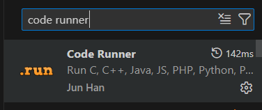
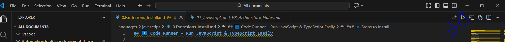
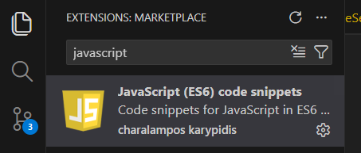

## 1️⃣ Code Runner – Run JavaScript & TypeScript Easily

### 🔹 Purpose
Run JavaScript and TypeScript files directly inside VS Code using a **Run ▶ icon** or shortcut.

### 🔹 Steps to Install
1. Open **VS Code**
2. Go to **Extensions** panel (Ctrl + Shift + X)
3. Search for **Code Runner**
4. Click **Install**





### 🔹 How to Use
- Open any `.js` or `.ts` file
- Click the **▶ Run Code** icon (top-right)
- OR use shortcut:
  - **Windows/Linux:** `Ctrl + Alt + N`
  - **Mac:** `Control + Option + N`

### 🔹 Output Location
- Output appears in **Terminal / Output panel**

---

## 2️⃣ JavaScript (ES6) Code Snippets – `clg` Shortcut

### 🔹 Purpose
Quickly write `console.log()` using a short keyword.

### 🔹 Steps to Install
1. Open **Extensions** panel
2. Search for **JavaScript (ES6) code snippets**
3. Install the extension



### 🔹 How to Use
1. Open a JavaScript or TypeScript file
2. Type:
   ```
   clg
   ```
3. Press **Tab** or **Enter**

### 🔹 Output
```js
console.log();
```

---

## ✅ Why This Setup Is Useful
- Faster debugging
- Clean developer workflow
- Very helpful for **QA Automation**, **Playwright**, **Node.js**, and **AI agent development**

---

## 🧠 Pro Tip
If Run icon does not appear:
- Right click editor → **Run Code**
- Or restart VS Code after installing Code Runner

---