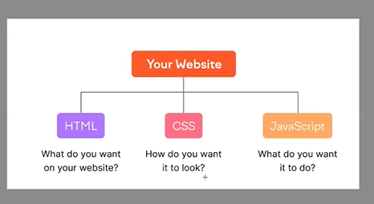
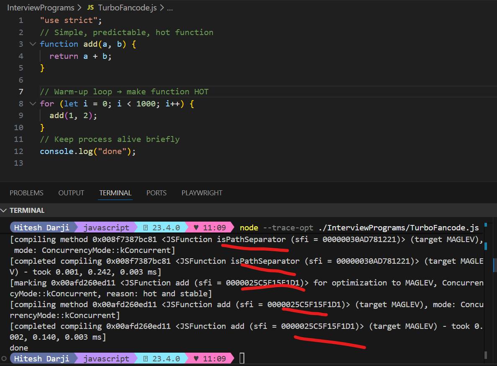
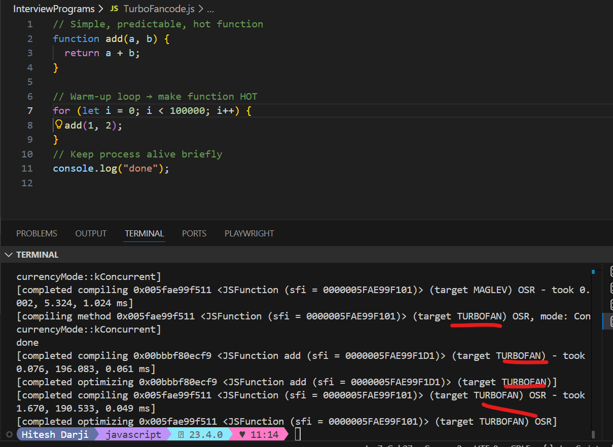

# JavaScript & V8 Engine

> **Audience:** Students & Working Professionals
> **Purpose:** Strong JavaScript foundation

---

## 1. What is JavaScript and Why Is It Popular?



**JavaScript** is a high-level, interpreted programming language mainly used to build interactive web applications.

### Why JavaScript Was Created?

- To add **Logic** to web pages.HTML and CSS can not do this things.

### Why JavaScript Is So Popular?

- Runs in **every browser**
- Easy to learn, powerful to use
- Works on **Frontend + Backend (Node.js)**
- Huge ecosystem (npm)
- Backbone of modern frameworks (React, Next, Angular, Vue)

---

## 2. JavaScript Engines & Execution Flow

### JavaScript Engines in Browsers

| Browser       | JavaScript Engine | Developed By |
| ------------- | ----------------- | ------------ |
| Chrome / Edge | V8                | Google       |
| Firefox       | SpiderMonkey      | Mozilla      |
| Safari        | JavaScriptCore    | Apple        |

---

## 3. JavaScript Outside Browser – Node.js

**Node.js** allows JavaScript to run outside the browser.

### Important Points

- Node.js is a **runtime**, not a framework
- Built on **V8 engine**
- Provides **system APIs** (file system, network, process)

✅ **Why V8 Is Fast?**

- Uses **JIT (Just-In-Time) compilation**
- Advanced optimizations

---

## 4. Popular IDEs and Their Focus

| IDE                | Optimized For               |
| ------------------ | --------------------------- |
| Eclipse            | Java, C, C++                |
| IntelliJ IDEA      | Java, JVM Languages         |
| Visual Studio Code | JavaScript, TypeScript, Web |
| PyCharm            | Python                      |
| Visual Studio      | C#, .NET, C++               |

---

## 5. JavaScript Architecture (V8 Engine)


---

### 2️⃣ Key Rule (MOST IMPORTANT)

> **V8 optimizes FUNCTIONS, not files or loops.**  
> Optimization depends on **how many times a function is called**.

---

### 3️⃣ Ignition, Maglev, TurboFan – What They Do

| Stage    | Type                | Purpose                               |
| -------- | ------------------- | ------------------------------------- |
| Ignition | Interpreter         | First execution, collects feedback    |
| Maglev   | Fast JIT Optimizer  | Optimizes hot & stable functions      |
| TurboFan | Heavy JIT Optimizer | Maximum performance for very hot code |

---

### 4️⃣ Optimization Call Count Rule (Approx)

| Function Call Count | V8 Decision       |
| ------------------- | ----------------- |
| 1–10                | Ignition          |
| 100–1,000           | Ignition + Maglev |
| 10,000+             | Maglev            |
| 100,000+            | TurboFan          |

Case-1 Ignition

```js
// Simple, predictable, hot function
function add(a, b) {
  return a + b;
}

// Warm-up loop → make function HOT
for (let i = 0; i < 10; i++) {
  add(1, 2);
}

// Keep process alive briefly
console.log("done");
```


Case-2 Ignition +maglev

```js
// Simple, predictable, hot function
function add(a, b) {
  return a + b;
}

// Warm-up loop → make function HOT
for (let i = 0; i < 1000; i++) {
  add(1, 2);
}
// Keep process alive briefly
console.log("done");
```



Case-3 Magvel

```js
// Simple, predictable, hot function
function add(a, b) {
  return a + b;
}

// Warm-up loop → make function HOT
for (let i = 0; i < 10000; i++) {
  add(1, 2);
}
// Keep process alive briefly
console.log("done");
```


Case-4 Turbo Fan

```js
// Simple, predictable, hot function
function add(a, b) {
  return a + b;
}

// Warm-up loop → make function HOT
for (let i = 0; i < 100000; i++) {
  add(1, 2);
}
// Keep process alive briefly
console.log("done");
```



> ⚠️ Exact numbers are not fixed. V8 decides dynamically.

---

### 5️⃣ CASE STUDY: 3 Real Optimization Cases

### ✅ Corrected Table (NO CONFUSION)

| Case   | Function Name                         | Approx Call Count | Optimizer               |
| ------ | ------------------------------------- | ----------------- | ----------------------- |
| Case-1 | isPathSeparator`                      | < 10              | Ignition                |
| Case-2 | `isPathSeparator`+ Anonymous function | 1000 (internal)   | Ignition + Maglev       |
| Case-3 | `isPathSeparator`+ Anonymous function | 10K–100K          | Maglev                  |
| Case-4 | `isPathSeparator`+ Anonymous function | 100K–Millions     | Maglev → TurboFan (OSR) |

---

### 6️⃣ Why Case-1 Shows Maglev Even with Small Loop?

- Your loop is small → stays in **Ignition**
- Node.js runtime runs many **internal functions**
- Those internal functions are called **thousands of times**
- V8 optimizes them using **Maglev**

> **Optimization is per-function, not per-program**

---

### 7️⃣ Case-1 vs Case-2 (Simple Explanation)

### Case-1

- Optimization happened
- But for **Node.js internal function**
- Your code logic stayed in Ignition

👉 **Process optimized, not your code**

### Case-2

- Your function called many times
- Became hot & stable
- Optimized by Maglev

👉 **Your code optimized**

---

## 8️⃣ What Happens When Code Gets Optimized?

When V8 optimizes code, it:

- Removes repeated type checks
- Converts bytecode → machine code
- Inlines small functions
- Removes dead / unreachable code
- Optimizes loops
- Uses CPU registers efficiently

❌ It does NOT change output  
❌ It does NOT change logic

---

### 9️⃣ De-Optimization (Important)

If assumptions break:

```js
add(1, 2); // number
add("1", "2"); // string
```

## When Maglev introduce in Node Js and purpose of that? and what impact before and after Maglev?

- **Maglev was introduced in 2023**
- First shipped with **V8 (Chrome 117)**
- Available in **Node.js 20 and above** (Node bundles V8)

👉 Practically:

> **If you are using Node.js 20+, Maglev is part of your runtime.**

---

## ❓ Why Was Maglev Introduced? (Purpose)

Before Maglev, V8 had only **two execution options**:

1. **Ignition (Interpreter)** – low cost but slow
2. **TurboFan (Heavy JIT)** – very fast but expensive to compile

There was a **large performance gap** between them.

---

## 🔴 Problems Before Maglev

- Many functions were:
  - Too hot for Ignition
  - Not heavy enough for TurboFan
- TurboFan compilation cost was often **higher than the benefit**
- Result:
  - Inconsistent performance
  - Wasted CPU time
  - Some hot functions stayed slow

---

## 🎯 Purpose of Maglev (One Line)

> **Maglev is a mid-tier JIT compiler that provides fast optimization with much lower compilation cost than TurboFan.**

---

## 🧠 Architecture: Before vs After Maglev

### 🔴 BEFORE Maglev (Till ~2022)

### 🔴 Before Maglev

| Aspect                | Situation              |
| --------------------- | ---------------------- |
| Startup time          | Fast                   |
| Warm code performance | ❌ Inconsistent        |
| TurboFan usage        | ❌ Often too expensive |
| CPU usage             | ❌ Sometimes wasted    |
| Real-world apps       | ❌ Performance spikes  |

---

### 🟢 After Maglev

| Aspect                | Situation                 |
| --------------------- | ------------------------- |
| Startup time          | Fast                      |
| Warm code performance | ✅ Much better            |
| TurboFan usage        | ✅ Only when worth it     |
| CPU usage             | ✅ Balanced               |
| Real-world apps       | ✅ Smoother & predictable |

---

## 🔁 Ignition vs Maglev vs TurboFan (Clear Roles)

| Stage      | Role                        | Compilation Cost | Usage                 |
| ---------- | --------------------------- | ---------------- | --------------------- |
| Ignition   | Run code + collect feedback | Very Low         | Always first          |
| **Maglev** | Fast optimization           | Medium           | Most hot functions    |
| TurboFan   | Maximum optimization        | High             | Rare, heavy functions |

---

## 🚀 What Changed for Developers?

### Before Maglev

- Many hot functions remained slow
- TurboFan optimization was risky
- Performance jumps were uneven

### After Maglev

- Hot user functions get optimized quickly
- Less dependence on TurboFan
- More predictable performance

👉 **Most real-world user code now stops at Maglev (which is ideal).**

---

## 🧠 Memory Hook (For Students)

> **Ignition = Run  
> Maglev = Speed  
> TurboFan = Maximum Speed**

---

## ✅ Final Exam / Interview Answer

> **“Maglev was introduced in 2023 (Node.js 20+) as a mid-tier JIT compiler between Ignition and TurboFan. It reduces the performance gap, lowers compilation cost, and improves real-world JavaScript performance by optimizing hot functions quickly without the heavy overhead of TurboFan.”**

---

## 6. What Is Node.js?

> **“Node.js is a JavaScript runtime environment built on the V8 engine. It allows JavaScript to run outside the browser by providing core libraries and system-level APIs. ”**

### What Node.js REALLY Is

✅ JavaScript runtime environment
✅ Built on Google’s V8 engine
✅ Executes JavaScript outside the browser
✅ Provides system-level APIs (file system, network, OS)
✅ Includes standard libraries and event-driven architecture

### What Node.js Is NOT

❌ Not a programming language
❌ Not a framework
❌ Not just a library

---

Notes:

- Errors mostly discovered at runtime
- Slower execution compared to JVM/V8
- High developer productivity

---

## 7. Error Detection Comparison (100 LOC Example)

| Language   | When errors are found |
| ---------- | --------------------- |
| JavaScript | runtime               |
| TypeScript | compile-time          |

---

## 8. Runtime & JIT Summary

| Language   | AOT        | JIT         | Runtime |
| ---------- | ---------- | ----------- | ------- |
| JavaScript | ❌         | ✅          | V8      |
| TypeScript | ✅ (to JS) | ✅ (via JS) | V8      |

---

## 9. Performance (General)

| Language   | Runtime Speed          |
| ---------- | ---------------------- |
| Java       | Fast                   |
| JavaScript | slower then Java       |
| TypeScript | slower then JavaScript |
| Python     | Slowest                |

---

## 10. Development Speed

| Language   | Dev Speed | Why                |
| ---------- | --------- | ------------------ |
| Python     | Fastest   | Simple syntax      |
| TypeScript | Fast      | Safety + tooling   |
| JavaScript | Medium    | Flexible but risky |

---

## 11. Installing & Running JavaScript

### Step 1: Initialize Project

```bash

npm init  -> ask input and create Package.json   OR
npm init -y  -> Create Package.json

And set Type ="module". Type="common" for old lagacy code of javascript project.

```


👉 This creates `package.json`

### Step 2: Run JavaScript File

```bash
node index.js
```

> Here `index.js` is the file name

✅ **No extra installation required for JavaScript**

---

## 12. Commands to view Bytecode

```bash
For print bytecode
node --print-bytecode yourfile.js

For see which code hotcode assign turbo

See JIT Optimization
node --trace-opt yourfile.jst
```
