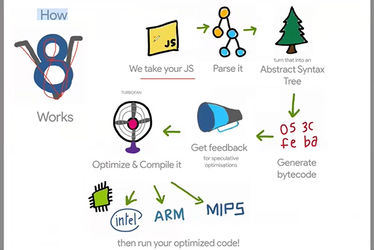

# Day 1 – JavaScript & V8 Engine

> **Audience:** Students & Working Professionals
> **Purpose:** Strong JavaScript foundation

---

## 1. What is JavaScript and Why Is It Popular?


**JavaScript** is a high-level, interpreted programming language mainly used to build interactive web applications.

### Why JavaScript Was Created?

- To add **Logic** to web pages.HTML and CSS can not do this things.
- To handle **events** (click, hover, submit)
- To manipulate **HTML & CSS dynamically**

### Why JavaScript Is So Popular?

- Runs in **every browser**
- Easy to learn, powerful to use
- Works on **Frontend + Backend (Node.js)**
- Huge ecosystem (npm)
- Backbone of modern frameworks (React, Next, Angular, Vue)

---

## 2. Why Big & Complex Projects Use TypeScript?

### Problem with JavaScript in Large Projects

- No strict type checking
- Errors found at runtime
- Hard to maintain large codebases

### Why TypeScript?

- Adds **static typing** on top of JavaScript
- Errors caught at **compile time**
- Better **code readability & maintainability**
- Excellent **IDE support & auto-suggestions**

👉 **Conclusion:**
Small scripts → JavaScript
Large & enterprise apps → **TypeScript**

---

## 3. JavaScript Engines & Execution Flow

### JavaScript Engines in Browsers

| Browser       | JavaScript Engine | Developed By |
| ------------- | ----------------- | ------------ |
| Chrome / Edge | V8                | Google       |
| Firefox       | SpiderMonkey      | Mozilla      |
| Safari        | JavaScriptCore    | Apple        |

---

## 4. JavaScript Outside Browser – Node.js

**Node.js** allows JavaScript to run outside the browser.

### Important Points

- Node.js is a **runtime**, not a framework
- Built on **V8 engine**
- Provides **system APIs** (file system, network, process)

✅ **Why V8 Is Fast?**

- Uses **JIT (Just-In-Time) compilation**
- Advanced optimizations

---

## 5. Popular IDEs and Their Focus

| IDE                | Optimized For               |
| ------------------ | --------------------------- |
| Eclipse            | Java, C, C++                |
| IntelliJ IDEA      | Java, JVM Languages         |
| Visual Studio Code | JavaScript, TypeScript, Web |
| PyCharm            | Python                      |
| Visual Studio      | C#, .NET, C++               |

---

## 6. JavaScript Architecture (V8 Engine)




### 1️⃣ Parsing → AST (Abstract Syntax Tree)

- JavaScript source code enters the engine
- **Lexer** breaks code into tokens
- **Parser** checks syntax and structure

👉 Output is **AST (Abstract Syntax Tree)**

**What is AST?**

- Tree representation of your code
- Shows:
  - variables
  - functions
  - loops
  - conditions

👉 Engine understands code **only after AST is created**

You can visualize AST here:  
👉 https://astexplorer.net/

---

### 2️⃣ AST → Bytecode (Ignition – Interpreter)

- AST is passed to **Ignition**
- Ignition converts AST into **Bytecode**

⚠️ Important:

- JavaScript is **NOT executed directly**
- **Bytecode is executed**, not JavaScript source

**Why Bytecode?**

- Faster than raw JavaScript
- Uses less memory
- Easy to optimize

👉 **All JavaScript code starts execution in Ignition**

---

### 3️⃣ Execution & Profiling

While executing bytecode, Ignition continuously profiles the code:

- Function call frequency
- Loop repetition
- Execution paths

| Code Type | Meaning             |
| --------- | ------------------- |
| Cold 🧊   | Rarely executed     |
| Warm 🌡️   | Sometimes executed  |
| Hot 🔥    | Executed many times |

👉 Profiling helps decide **which code needs optimization**

---

### 4️⃣ JIT Compilation – TurboFan

When code becomes **HOT 🔥**:

- Bytecode is sent to **TurboFan**
- TurboFan converts bytecode → **Optimized Machine Code**

**Optimizations include:**

- Function inlining
- Loop optimization
- Removing unnecessary checks

⚠️ Key Point:

> **JIT does NOT optimize JavaScript source code**  
> **It optimizes hot bytecode into machine code**

---

### 5️⃣ Optimized Execution

- CPU executes optimized machine code
- Hot code runs **very fast**
- Cold code continues execution in Ignition

👉 Interpreter and compiler work **together**

---

## Complete Execution Flow (Diagram)

JavaScript Source Code
↓
Lexer
↓
Parser
↓
AST
↓
Ignition (Interpreter)
↓
Bytecode
↓
Profiling
↓
Hot Code Detected
↓
TurboFan (JIT Compiler)
↓
Optimized Machine Code
↓
CPU Execution

---

## 7. What Is Node.js?

> **“Node.js is a JavaScript runtime environment built on the V8 engine. It allows JavaScript to run outside the browser by providing core libraries and system-level APIs. It is not a programming language and not just a library.”**

### What Node.js REALLY Is

✅ JavaScript runtime environment  
✅ Built on Google’s V8 engine  
✅ Executes JavaScript outside the browser  
✅ Provides system-level APIs (file system, network, OS)  
✅ Includes standard libraries and event-driven architecture

### What Node.js Is NOT

❌ Not a programming language  
❌ Not a framework  
❌ Not just a library

---

Notes:

- Errors mostly discovered at runtime
- Slower execution compared to JVM/V8
- High developer productivity

---

## 8. Error Detection Comparison (100 LOC Example)

| Language   | When errors are found |
| ---------- | --------------------- |
| JavaScript | runtime               |
| TypeScript | compile-time          |
| Python     | Runtime               |

---

## 9. Runtime & JIT Summary

| Language   | AOT        | JIT         | Runtime |
| ---------- | ---------- | ----------- | ------- |
| JavaScript | ❌         | ✅          | V8      |
| TypeScript | ✅ (to JS) | ✅ (via JS) | V8      |

---

## 10. Performance (General)

| Language   | Runtime Speed          |
| ---------- | ---------------------- |
| Java       | Fast                   |
| JavaScript | slower then Java       |
| TypeScript | slower then JavaScript |
| Python     | Slowest                |

---

## 11. Development Speed

| Language   | Dev Speed | Why                |
| ---------- | --------- | ------------------ |
| Python     | Fastest   | Simple syntax      |
| TypeScript | Fast      | Safety + tooling   |
| JavaScript | Medium    | Flexible but risky |

---

## 12. Installing & Running JavaScript

### Step 1: Initialize Project

```bash

npm init  -> ask input and create Package.json   OR
npm init -y  -> Create Package.json

```

👉 This creates `package.json`

### Step 2: Run JavaScript File

```bash
node index.js
```

> Here `index.js` is the file name

✅ **No extra installation required for JavaScript**

---

## 13. Commands to view Bytecode

```bash
For print bytecode
node --print-bytecode yourfile.js

For see which code hotcode assign turbo

See JIT Optimization
node --trace-opt yourfile.js

See De-optimization
node --trace-deopt yourfile.js

Inline Cache Behavior
node --trace-ic yourfile.js

Full Trace
node --trace-opt --trace-deopt --trace-ic yourfile.js
```
