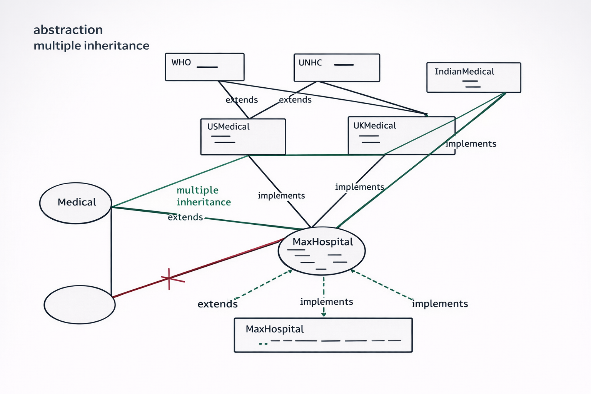

# OOP Concepts in TypeScript – Inheritance, Interface, Abstraction (Complete Guide)

> **Purpose**: This document is created for **students and framework developers** to clearly understand **Inheritance, Interfaces, Abstract Classes, `implements`, `extends`, `override`, `super`, and Interface-as-Type** using **real, runnable TypeScript code** and **real automation framework use‑cases**.

---

## Visual Architecture (Concept Diagram)

This diagram visually explains **how inheritance and interfaces flow together** in the Medical example.

👉 Use this image while explaining to students **before showing code**.



### How students should read this diagram

1. **Top boxes (WHO, UNSC)**
   - These are **interfaces**
   - They define _capabilities / rules_ (no implementation)

2. **Middle boxes (USMedical, UKMedical, IndianMedical)**
   - These are also **interfaces**
   - They **extend multiple interfaces** (multiple inheritance allowed)

3. **Medical class**
   - This is a **normal class**
   - Only **single inheritance** is allowed using `extends`

4. **MaxHospital (final class)**
   - `extends Medical` → reuse behavior
   - `implements USMedical, UKMedical, IndianMedical` → promise to implement all methods

5. **Emergency method (common method)**
   - Declared in multiple interfaces
   - Implemented **only once** in `MaxHospital`

This diagram answers the most common student confusion:

> "Why TypeScript allows multiple inheritance using interface but not class?"

---

# PART 1: INTERFACE + INHERITANCE (Medical Example)

## 1. `admin` class (Concrete class)

```ts
export class admin {
  billing(): void {
    console.log("billing admin");
  }
}
```

---

## 2. `who` interface (Interface extending a class)

```ts
import { admin } from "./admin";

// Interface extending a class (allowed in TypeScript)
export interface who extends admin {
  covid(): void;
}
```

### Notes for students

- Practically **rare**, but **allowed in TypeScript**
- Interface inherits **method signatures only**

---

## 3. `UNSC` interface

```ts
export interface UNSC {
  publicMediaNews(): void;
}
```

---

## 4. `USmedical` interface (Multiple inheritance)

```ts
import { UNSC } from "./UNSC";
import { who } from "./who";

export interface USmedical extends who, UNSC {
  min_free: number;
  physio(): void;
  cardio(): void;
  emergency(): void;
}
```

### Key learning

- **Multiple interface inheritance is allowed** in TypeScript
- **100% abstraction**

---

## 5. `UKMedical` interface

```ts
export interface UKMedical {
  oncology(): void;
  pedia(): void;
  dental(): void;
  emergency(): void;
}
```

---

## 6. `Indiamedical` interface

```ts
export interface Indiamedical {
  gastro(): void;
  ent(): void;
  emergency(): void;
}
```

---

## 7. `Medical` base class (Single inheritance)

```ts
export class Medical {
  research(): void {
    console.log("medical research");
  }
}
```

---

## 8. `MaxHospital` class (REAL implementation)

```ts
import { Indiamedical } from "./Indiamedical";
import { UKMedical } from "./UKMedical";
import { USmedical } from "./USmedical";
import { Medical } from "./Medical";

export class MaxHospital
  extends Medical
  implements USmedical, UKMedical, Indiamedical
{
  min_free: number = 10;

  billing(): void {
    console.log("billing");
  }

  publicMediaNews(): void {
    console.log("publicMediaNews");
  }

  covid(): void {
    console.log("covid who");
  }

  emergency(): void {
    console.log("emergency"); // implemented once only
  }

  gastro(): void {
    console.log("MaxHospital: Providing gastroenterology services");
  }

  ent(): void {
    console.log("MaxHospital: Providing ENT services");
  }

  oncology(): void {
    console.log("MaxHospital: Providing oncology services");
  }

  pedia(): void {
    console.log("MaxHospital: Providing pediatric services");
  }

  dental(): void {
    console.log("MaxHospital: Providing dental services");
  }

  physio(): void {
    console.log("MaxHospital: Providing physiotherapy services");
  }

  cardio(): void {
    console.log("MaxHospital: Providing cardiology services");
  }

  opd(): void {
    console.log("max hospital opd services");
  }

  override research(): void {
    console.log("max research");
  }
}
```

---

## 9. Execution Code + Output

```ts
import { MaxHospital } from "./MaxHospital";

let mx = new MaxHospital();

mx.cardio();
mx.dental();
mx.emergency();
mx.ent();
mx.gastro();
mx.oncology();
mx.opd();
mx.pedia();
mx.physio();
mx.research();
mx.publicMediaNews();
console.log(mx.min_free);
```

---

# PART 2: ABSTRACT CLASS (Page Object Model Example)

## 10. Abstract `Page` class

```ts
export abstract class Page {
  name: string;
  timer: number;

  constructor(name: string, timer: number) {
    this.name = name;
    this.timer = timer;
  }

  abstract title(): void;
  abstract url(): void;

  loadingTime(): void {
    console.log("page -- loading...10 secs");
  }
}
```

### Why abstract class?

- Base template for all pages
- Shared logic + enforced methods

---

## 11. `LoginPage` implementation

```ts
export class LoginPage extends Page {
  constructor(name: string, timer: number) {
    super(name, timer);
  }

  override title(): void {
    console.log("login page title");
  }

  override url(): void {
    console.log("login page url -- http://abc.com");
  }

  override loadingTime(): void {
    console.log("login page -- loading...2 secs");
  }

  login(username: string, password: string): void {
    console.log("login with :" + username, password);
  }
}
```

---

## 12. Execution

```ts
let lp = new LoginPage("amazon", 40);

console.log(lp.name, lp.timer);

lp.title();
lp.url();
lp.loadingTime();
lp.login("admin", "admin");
```

---

# PART 3: INTERFACE AS TYPE (Composition)

## 13. Interfaces

```ts
export interface User {
  name: string;
  age: number;
  drive(): void;
}

export interface Customer {
  salary: number;
  login(): boolean;
}
```

---

## 14. Interface intersection (`&`)

```ts
let user: User & Customer = {
  name: "Tom",
  age: 30,
  salary: 12.33,

  login(): boolean {
    console.log("user is logged", user.name, user.age);
    return true;
  },

  drive(): void {
    console.log("user is driving", user.name, user.age);
  },
};

console.log(user.name);
user.drive();
user.login();
console.log(user.salary);
```

### Why use this?

- API response modeling
- DTOs
- Dynamic object composition

---

# FINAL SUMMARY (Framework Rule)

| Situation           | Use                   |
| ------------------- | --------------------- |
| Common capability   | Interface             |
| Shared behavior     | Abstract class        |
| Tool specific logic | Class                 |
| Multiple capability | Interface inheritance |
| Driver setup reuse  | `super()`             |
| Safe method change  | `override`            |
| Data modeling       | Interface as type     |

---

### ONE LINE TO REMEMBER

> **Interfaces define WHAT, abstract classes define HOW partially, and classes define the final implementation.**
