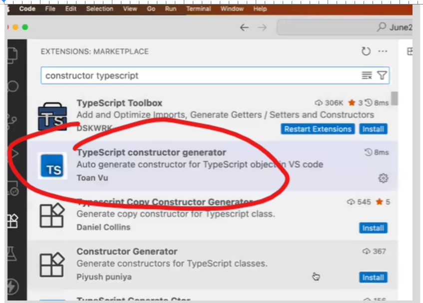

# What covered in notes

- Constructor Generator using plaugins

## Why we learn?

- Saves time
- Avoids manual constructor writing
- Reduces mistakes
- Very useful for **classes with many variables**

---

## Step 1: Install Required Plugin

Open **VS Code → Extensions Marketplace** and search for:

### ✅ Recommended Plugin

**TypeScript constructor generator**

- Author: Toan Vu
- Purpose: Auto-generate constructor for TypeScript classes
  

Click **Install** and reload VS Code if required.

---

## Step 2: Create a TypeScript Class

Write a class with properties **only** (no constructor):

```ts
export class Employee {
  public name: string;
  public age: number;
}
```

Make sure:

- Properties are defined
- Cursor is inside the class

---

## Step 3: Open Command Palette

Use shortcut:

- **Windows / Linux** → `Ctrl + Shift + P`
- **Mac** → `Cmd + Shift + P`

---

## Step 4: Generate Constructor

1. In Command Palette, type:
   ```
   constructor
   ```
2. Select:
   **TypeScript: Generate Constructor**
   
3. Press **Enter**

---

## Step 5: Result (Auto-Generated Constructor)

The plugin will automatically add constructor like below:

```ts
export class Employee {
  public name: string;
  public age: number;

  constructor(name: string, age: number) {
    this.name = name;
    this.age = age;
  }
}
```

✔ Constructor parameters match class properties
✔ Assignments are auto-generated

---

## Notes (Important)

- Works only for **TypeScript files (`.ts`)**
- Class must have properties defined
- No constructor should exist before generation

---

## Best Use Cases

- DTO classes
- Page Object Models (Playwright)
- Model / Entity classes
- Builder Pattern & Singleton setup

---

## Summary

- Install **TypeScript constructor generator** plugin
- Define class properties
- Use Command Palette
- Constructor is generated automatically
